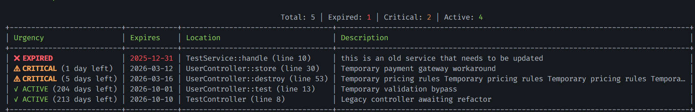
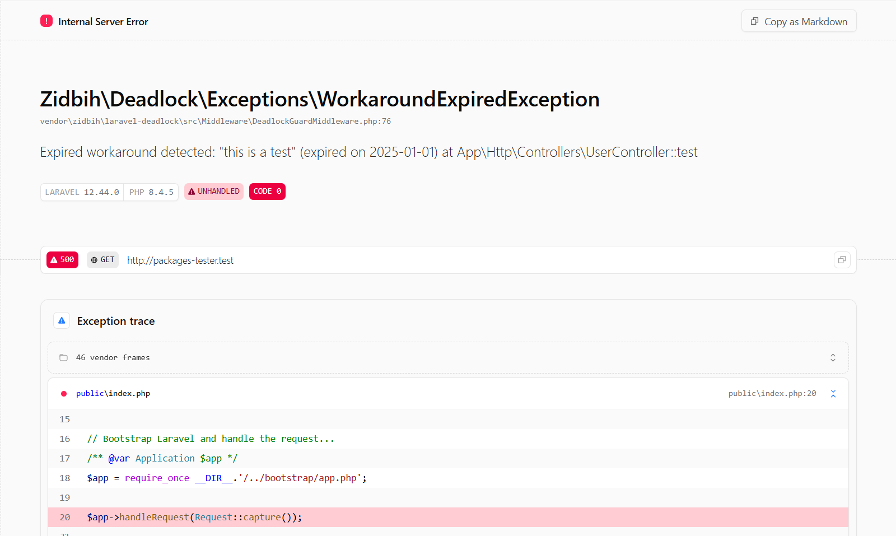

# Laravel Deadlock

Have you ever shipped a **temporary workaround** and completely forgot about it?  
Have you ever said *“we’ll fix this later”* and later never came?

**Laravel Deadlock** is a Laravel package that helps teams manage technical debt intentionally.

It allows developers to mark temporary workaround code with an **expiration date** and enforce it automatically.

Instead of relying on comments like `TODO` or forgotten tickets, Laravel Deadlock turns technical debt into **explicit, time-boxed, enforceable rules**.

---

## The Idea

Instead of relying on comments like:

    // TODO: remove this later

You explicitly mark temporary code using an attribute:

    #[Workaround(
        description: 'Temporary bypass for legacy payment gateway',
        expires: '2025-03-01'
    )]

Laravel Deadlock then:

- Scans the codebase statically  
- Reports all workarounds and their status  
- Fails CI when a workaround expires  
- Blocks local execution of expired code  
- Never enforces in production  

---

## Installation

```bash
composer require zidbih/laravel-deadlock
```

### Requirements

- PHP: **8.2+**
- Laravel: **10, 11, 12**

---

## Quick Start

Import the attribute and apply it to a class or method.

```php
use Zidbih\Deadlock\Attributes\Workaround;

#[Workaround(
    description: 'Temporary bypass for legacy payment gateway',
    expires: '2025-03-01'
)]
class PaymentService
{
    // ...
}
```
>**Note**  
> The `#[Workaround]` attribute is supported on **classes and methods only**.  
> Workarounds placed inside functions or other scopes will be ignored.


### What happens when it expires?

- **Local Development**: Execution is blocked with an exception  
- **CI/CD**: Pipelines fail when running the check command  
- **Production**: No effect — safe by design  

---

## Enforcement Modes

Laravel Deadlock distinguishes between different class types to keep performance high while enforcing debt where it matters most.

---

### 1. Controllers (Automatic)

Controller classes and controller methods are automatically discovered and enforced at runtime.

You only need to add the `#[Workaround]` attribute. No additional runtime code is required.

```php
namespace App\Http\Controllers;

use Zidbih\Deadlock\Attributes\Workaround;

#[Workaround(description: 'Legacy controller awaiting refactor', expires: '2025-06-01')]
final class UserController extends Controller
{
    #[Workaround(description: 'Temporary validation bypass', expires: '2025-02-01')]
    public function store()
    {
        //...
    }
}
```

---

### 2. Services & Other Classes (Explicit)

For services, jobs, commands, and other non-controller classes, enforcement is **explicit by design**.  
The guard must be called intentionally, eliminating hidden behavior and avoiding unnecessary performance overhead.

#### Class-Level Enforcement

```php
namespace App\Services;

use Zidbih\Deadlock\Attributes\Workaround;
use Zidbih\Deadlock\Support\DeadlockGuard;

#[Workaround(description: 'Temporary legacy pricing service', expires: '2025-01-01')]
final class PricingService
{
    public function __construct()
    {
        DeadlockGuard::check($this);
    }
}
```

#### Method-Level Enforcement

```php
namespace App\Services;

use Zidbih\Deadlock\Attributes\Workaround;
use Zidbih\Deadlock\Support\DeadlockGuard;

final class PricingService
{
    #[Workaround(description: 'Temporary calculation logic', expires: '2025-02-01')]
    public function calculate()
    {
        DeadlockGuard::check($this, __FUNCTION__);

        return 42;
    }
}
```

---

## Artisan Commands

### List All Workarounds

Scans the codebase and displays all detected workarounds.
By default, all workarounds are shown.

```bash
php artisan deadlock:list
```

**Example output:**



### Filter expired workarounds

Show only workarounds that have passed their expiration date.

```bash
php artisan deadlock:list --expired
```

### Filter active workarounds

Show only non-expired workarounds.

``` bash
php artisan deadlock:list --active
```

### Filter critical workarounds

Show only workarounds expiring in **7 days or less**.

``` bash
php artisan deadlock:list --critical
```
---

## CI/CD Enforcement

Run the check command in your CI pipeline:

```bash
php artisan deadlock:check
```

If an expired workaround is found, the command exits with **code 1** and the pipeline fails.

**Example failure output:**

```
Expired workarounds detected:

- Temporary payment gateway workaround | expires: 2025-02-10 | PaymentService::process
- Legacy admin controller | expires: 2025-01-31 | AdminController
```

### CI example

```yaml
- name: Deadlock check
  run: php artisan deadlock:check
```

---

## Runtime Enforcement (Local Only)

When an expired workaround is accessed locally, a  
`WorkaroundExpiredException` is thrown with:

- Description
- Expiration date
- Exact code location

This provides immediate and unmissable feedback during development.
> Example of the exception thrown when an expired workaround is accessed locally.



---

## Production Safety

Laravel Deadlock **never enforces debt in production**.

- Runtime exceptions only occur in **local** environments
- CI blocks merges before debt reaches production
- Live users are never affected

---

## Testing

The test suite uses **PHPUnit** and **Orchestra Testbench** to ensure compatibility across all supported Laravel versions.

---

## License

[MIT](LICENSE)

## Contributing

See [CONTRIBUTING.md](CONTRIBUTING.md)