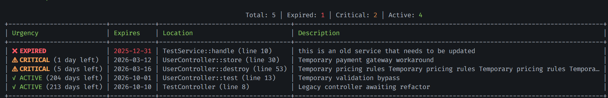
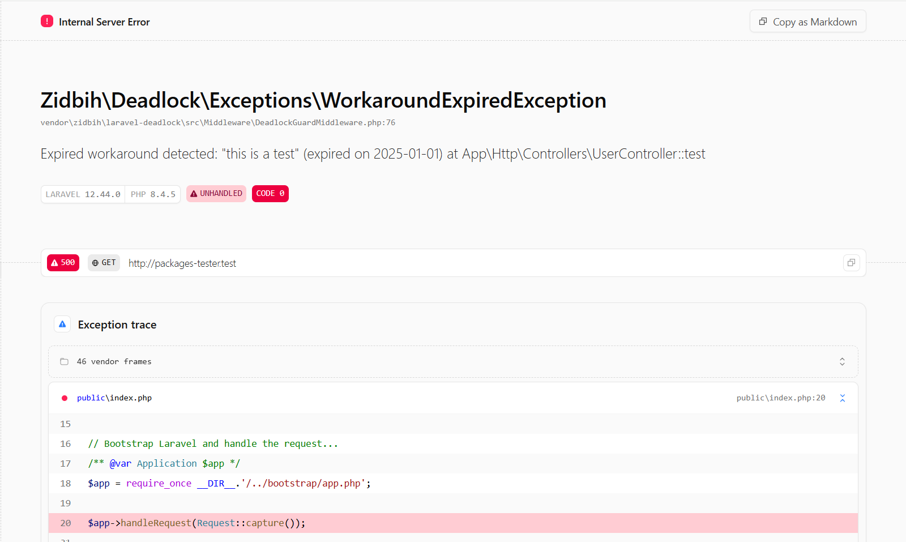

<div align="center">

# Laravel Deadlock


[](https://codecov.io/gh/medmahmoudhdaya/laravel-deadlock)

</div>

Laravel Deadlock helps you track temporary workarounds before they turn into permanent debt.

Annotate classes or methods with an expiration date, then enforce those deadlines in local development and CI without affecting production.

## What It Does

- Scans the codebase for `#[Workaround]` attributes
- Lists workarounds and their status
- Fails CI when a workaround has expired
- Blocks local execution of expired code
- Never enforces in production

---

## Installation

```bash
composer require zidbih/laravel-deadlock
```

### Compatibility

- Laravel **10, 11, 12** with PHP **8.2+**
- Laravel **13** with PHP **8.3+**

---

## Quick Start

Add `#[Workaround]` to a class or method with a clear description and expiration date.

```php
use Zidbih\Deadlock\Attributes\Workaround;

#[Workaround(
    description: 'Temporary bypass for legacy payment gateway',
    expires: '2025-03-01'
)]
class PaymentService
{
    // ...
}
```

`#[Workaround]` supports **classes** and **methods**. Other scopes are ignored.

### When It Expires

- **Local Development**: Execution is blocked with an exception
- **CI/CD**: Pipelines fail when running the check command
- **Production**: No effect

---

## Runtime Enforcement

### Automatic Enforcement for Controllers

Controllers are discovered automatically and enforced at runtime.  
Add the attribute; no additional calls are required.

```php
namespace App\Http\Controllers;

use Zidbih\Deadlock\Attributes\Workaround;

#[Workaround(description: 'Legacy controller awaiting refactor', expires: '2025-06-01')]
final class UserController extends Controller
{
    #[Workaround(description: 'Temporary validation bypass', expires: '2025-02-01')]
    public function store()
    {
        // ...
    }
}
```

### Explicit Enforcement for Services, Jobs, and Commands

For non-controller classes, enforcement is explicit by design to avoid hidden runtime behavior.

#### Class-Level

```php
namespace App\Services;

use Zidbih\Deadlock\Attributes\Workaround;
use Zidbih\Deadlock\Support\DeadlockGuard;

#[Workaround(description: 'Temporary legacy pricing service', expires: '2025-01-01')]
final class PricingService
{
    public function __construct()
    {
        DeadlockGuard::check($this);
    }
}
```

#### Method-Level

```php
namespace App\Services;

use Zidbih\Deadlock\Attributes\Workaround;
use Zidbih\Deadlock\Support\DeadlockGuard;

final class PricingService
{
    #[Workaround(description: 'Temporary calculation logic', expires: '2025-02-01')]
    public function calculate()
    {
        DeadlockGuard::check($this, __FUNCTION__);

        return 42;
    }
}
```

---

## Artisan Commands

### `deadlock:list`

List all detected workarounds and their current status.

```bash
php artisan deadlock:list
```

Example output:



#### Filters

- Show only expired workarounds:

```bash
php artisan deadlock:list --expired
```

- Show only active workarounds:

```bash
php artisan deadlock:list --active
```

- Show workarounds expiring in **7 days or less**:

```bash
php artisan deadlock:list --critical
```

#### Summary

The command includes a summary line by default so totals are visible at a glance.

### `deadlock:check`

Fail CI when one or more workarounds have expired.

```bash
php artisan deadlock:check
```

If an expired workaround is found, the command exits with **code 1**.

For machine-readable output, use JSON mode:

```bash
php artisan deadlock:check --json
```

Example JSON output:

```json
{
  "success": false,
  "expired_count": 1,
  "expired": [
    {
      "description": "Temporary payment gateway workaround",
      "expires": "2025-02-10",
      "location": "PaymentService::process",
      "file": "/app/Services/PaymentService.php",
      "line": 18,
      "class": "PaymentService",
      "method": "process"
    }
  ]
}
```

Example failure output:

```
Expired workarounds detected:

- Temporary payment gateway workaround | expires: 2025-02-10 | PaymentService::process
- Legacy admin controller | expires: 2025-01-31 | AdminController
```

### `deadlock:doctor`

Diagnose workaround usage that may look valid but will not behave as expected.

```bash
php artisan deadlock:doctor
```

The doctor command reports unsupported `#[Workaround]` targets, invalid attribute arguments, and missing or incorrect `DeadlockGuard::check(...)` calls for explicit runtime enforcement.

### `deadlock:extend`

Update the `expires` date of an existing `#[Workaround]` attribute in your source code.

It supports three target modes:

- Extend the workaround on a class
- Extend the workaround on one method
- Extend every workaround declared on a class

#### Targeting

Use exactly one of these target options:

- `--class=App\Services\PricingService`
- `--controller=TestController`

`--controller` is a shortcut for classes under `App\Http\Controllers`.

Examples:

```bash
php artisan deadlock:extend --controller=TestController --days=7
php artisan deadlock:extend --controller=Admin\TestController --method=index --months=1
php artisan deadlock:extend --class=App\Services\PricingService --days=7
```

#### How Targeting Works

`--class` only:
- Targets the class-level `#[Workaround]` on that class

`--class` or `--controller` with `--method=...`:
- Targets only the workaround on that method

`--class` or `--controller` with `--all`:
- Targets the class-level workaround
- Targets every method-level workaround declared on that class

#### Date Options

You must provide either:

- `--days=N`
- `--months=N`
- `--date=YYYY-MM-DD`

You may combine `--days` and `--months` in the same command.

```bash
php artisan deadlock:extend --class=App\Services\PricingService --months=1 --days=7
```

`--date` is absolute and replaces the current expiry date directly.

```bash
php artisan deadlock:extend --class=App\Services\PricingService --date=2026-06-01
```

`--date` cannot be combined with `--days` or `--months`.

#### Examples

Extend a class-level workaround:

```bash
php artisan deadlock:extend --class=App\Services\PricingService --days=7
```

Extend a method-level workaround:

```bash
php artisan deadlock:extend --class=App\Services\PricingService --method=calculate --days=7
```

Extend every workaround on a class:

```bash
php artisan deadlock:extend --class=App\Services\PricingService --all --months=1 --days=7
```

Extend a controller workaround:

```bash
php artisan deadlock:extend --controller=TestController --days=7
```

Extend a nested controller method workaround:

```bash
php artisan deadlock:extend --controller=Admin\TestController --method=index --date=2026-06-01
```

#### Validation

- Use exactly one of `--class` or `--controller`
- `--method` and `--all` cannot be used together
- Without `--method` or `--all`, the command updates only the class-level workaround
- `--days` and `--months` must be positive integers
- `--date` must use `YYYY-MM-DD`
- The target class must resolve to a real PHP file
- The targeted class or method must already have a `#[Workaround]`

---

## CI/CD Integration

Run the check command in your pipeline:

```bash
php artisan deadlock:check
```

CI example:

```yaml
- name: Deadlock check
  run: php artisan deadlock:check
```

---

## Runtime Exceptions

When expired code is accessed locally, a `WorkaroundExpiredException` is thrown with:

- Description
- Expiration date
- Exact code location

Example exception output:



---

## Production Safety

Laravel Deadlock never enforces workaround deadlines in production.

- Runtime exceptions only occur in **local** environments
- CI blocks merges before debt reaches production
- Live users are never affected

---

## Contributing

See [CONTRIBUTING.md](CONTRIBUTING.md)

---

## License

[MIT](LICENSE)
